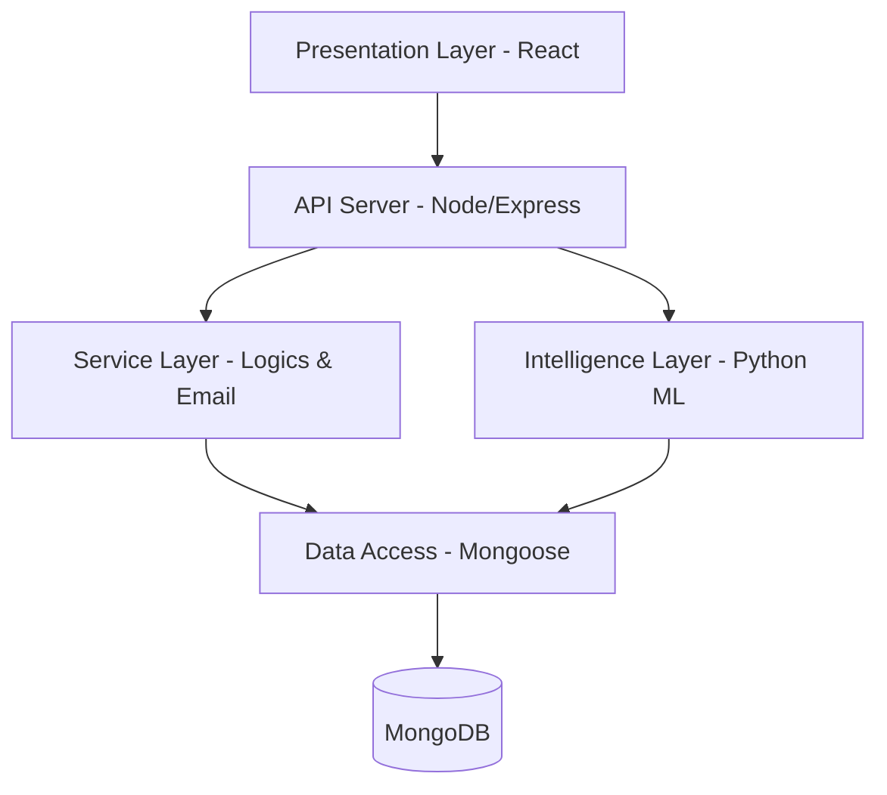

# 🛡️ TT SecureWatch - Cyber Alert Platform
[](https://reactjs.org/)
[](https://nodejs.org/)
[](https://www.python.org/)
[](https://www.mongodb.com/)
[](https://tailwindcss.com/)
**TT SecureWatch** is an intelligent Security Information and Event Management (SIEM) orchestration platform designed to combat "Alert Fatigue" in modern SOC (Security Operations Centers). Developed as a PFE project at **Tunisie Telecom (DSSI)**, it leverages Machine Learning (Random Forest) to classify, prioritize, and automate responses to cybersecurity threats.
---
## 🚀 Key Features
-   **🧠 AI-Driven Alert Classification**: Automatically identifies and categorizes attacks (DDoS, Injection, Backdoor, etc.) using a Random Forest model trained on the ToN-IoT dataset.
-   **📊 Dynamic SOC Dashboard**: Real-time visualization of security metrics, risk scores, and threat trends using interactive charts.
-   **⚡ Automated Response (SOAR)**: Automated email notifications and incident escalation for critical severity alerts.
-   **📋 SOC Playbooks**: Guided step-by-step procedures for analysts to handle detected incidents efficiently.
-   **🔒 Secure RBAC**: Role-based access control for Analysts and Administrators with JWT authentication.
-   **📡 Real-time Log Ingestion**: Simulation and processing of SIEM logs via flexible collectors.
---
## 🛠️ Tech Stack
### Frontend
- **Framework**: React 19 (TypeScript)
- **Styling**: Tailwind CSS
- **Visualization**: Recharts & Lucide Icons
- **State Management**: React Context API
### Backend & AI
- **API Server**: Node.js & Express
- **Database**: MongoDB (Mongoose ODM)
- **ML Engine**: Python (Scikit-learn, Flask/FastAPI)
- **Notification**: Nodemailer (SMTP)
---
## 🏗️ Architecture
The platform follows a **Modular Monolithic Architecture** divided into five distinct layers:

---
## 🚦 Getting Started
### Prerequisites
- Node.js (v20+)
- Python (v3.12+)
- MongoDB (Running locally or via Atlas)
### Installation
1. **Clone the repository**
   ```bash
   git clone https://github.com/YasmineHammami93/cyber-alert-platform.git
   cd cyber-alert-platform
   ```
2. **Backend Setup**
   ```bash
   cd backend
   npm install
   # Create a .env file based on .env.example
   npm start
   ```
3. **Machine Learning API Setup**
   ```bash
   cd ml
   pip install -r requirements.txt
   python api.py
   ```
4. **Frontend Setup**
   ```bash
   cd frontend
   npm install
   npm start
   ```
### 🏃 Quick Start (Windows)
Run the automated startup script:
```bash
./start_demo.bat
```
---
## 📝 Project Context
This project was developed as part of a **Graduation Project (PFE)** at **Tunisie Telecom**.
- **Organization**: Direction de la Sécurité des Systèmes d'Information (DSSI)
- **Objective**: Optimize SOC operations through automation and intelligent alert classification.
---
## 📄 License
This project is for academic purposes. All rights reserved to Tunisie Telecom and the developer.
---
<p align="center">
  Made with ❤️ for Cyber Security
</p>
