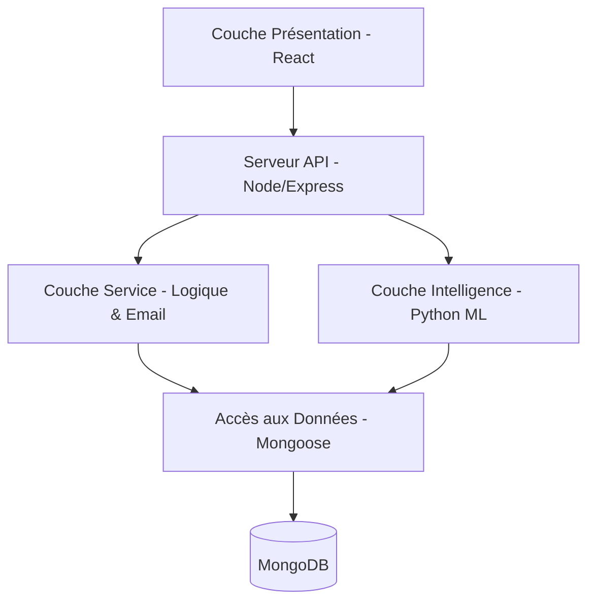

# 🛡️ TT SecureWatch - Plateforme d'Alerte Cyber
[](https://reactjs.org/)
[](https://nodejs.org/)
[](https://www.python.org/)
[](https://www.mongodb.com/)
[](https://tailwindcss.com/)
**TT SecureWatch** est une plateforme intelligente de gestion et d'orchestration SIEM conçue pour lutter contre la "fatigue des alertes" dans les centres d'opérations de sécurité (SOC) modernes. Développé dans le cadre d'un projet de fin d'études (PFE) chez **Tunisie Telecom (DSSI)**, ce système utilise l'Intelligence Artificielle (Random Forest) pour classifier, prioriser et automatiser la réponse aux menaces cyber.
---
## 🚀 Fonctionnalités Clés
-   **🧠 Classification d'Alertes par IA**: Identification et catégorisation automatique des attaques (DDoS, Injection, Backdoor, etc.) via un modèle Random Forest entraîné sur le dataset ToN-IoT.
-   **📊 Dashboard SOC Dynamique**: Visualisation en temps réel des métriques de sécurité, des scores de risque et des tendances via des graphiques interactifs.
-   **⚡ Automatisation de la Réponse (SOAR)**: Notifications par email et escalade automatique pour les alertes à sévérité critique.
-   **📋 Playbooks SOC**: Procédures guidées pour aider les analystes à traiter efficacement les incidents détectés.
-   **🔒 Contrôle d'Accès Sécurisé (RBAC)**: Gestion des rôles Analyste et Administrateur avec authentification JWT.
-   **📡 Ingestion de Logs en Temps Réel**: Simulation et traitement des logs SIEM via des collecteurs flexibles.
---
## 🛠️ Stack Technique
### Frontend
- **Framework**: React 19 (TypeScript)
- **Styling**: Tailwind CSS / Lucide Icons
- **Visualisation**: Recharts
- **Gestion d'État**: React Context API
### Backend & AI
- **Serveur API**: Node.js & Express
- **Base de Données**: MongoDB (Mongoose ODM)
- **Moteur ML**: Python (Scikit-learn, Flask/FastAPI)
- **Notification**: Nodemailer (SMTP)
---
## 🏗️ Architecture
La plateforme suit une **Architecture Modulaire Monolithique** divisée en cinq couches distinctes :

---
## 🚦 Installation et Démarrage
### Prérequis
- Node.js (v20+)
- Python (v3.12+)
- MongoDB (Local ou Atlas)
### Installation
1. **Cloner le projet**
   ```bash
   git clone https://github.com/YasmineHammami93/cyber-alert-platform.git
   cd cyber-alert-platform
   ```
2. **Configuration du Backend**
   ```bash
   cd backend
   npm install
   # Créez un fichier .env basé sur .env.example
   npm start
   ```
3. **Configuration de l'API ML**
   ```bash
   cd ml
   pip install -r requirements.txt
   python api.py
   ```
4. **Configuration du Frontend**
   ```bash
   cd frontend
   npm install
   npm start
   ```
### 🏃 Démarrage Rapide (Windows)
Utilisez le script d'automatisation :
```bash
./start_demo.bat
```
---
## 📝 Contexte du Projet
Ce projet a été réalisé pour le **Projet de Fin d'Études (PFE)** au sein de **Tunisie Telecom**.
- **Organisme**: Direction de la Sécurité des Systèmes d'Information (DSSI)
- **Objectif**: Optimiser les opérations SOC par l'automatisation et la classification intelligente des alertes.
---
## 📄 Licence
Ce projet est destiné à un usage académique. Tous droits réservés à Tunisie Telecom et à l'auteur.
---
<p align="center">
  Propulsé par ❤️ pour la Cybersécurité
</p>
# Dependencies
node_modules/
.venv/
env/
venv/
ENV/
pycache/
*.pyc
# IDEs
.vscode/
.idea/
# OS files
.DS_Store
Thumbs.db
# Environment variables
.env
.env.local
# Build outputs
dist/
build/
*.pkl
*.json
!model_columns.json
# Local databases
*.sqlite
*.db
# Logs
logs/
*.log

